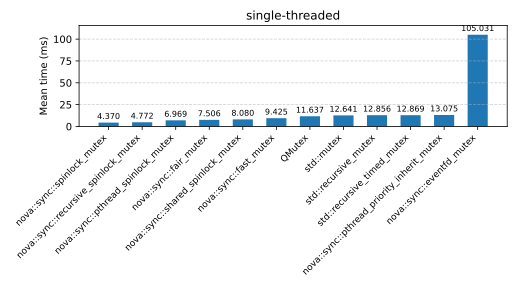
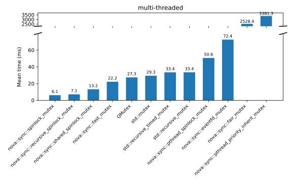
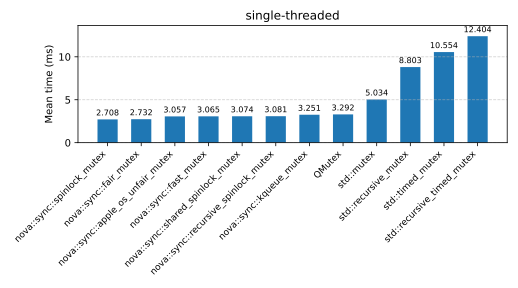
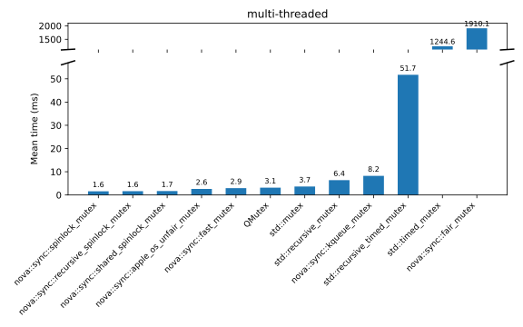

# nova::sync

Synchronization primitives for C++20: specialized mutex types optimized for use cases.

## Mutex Types

| Type | Characteristics | Named Requirement |
|------|-----------------|-------------------|
| `spinlock_mutex` | Simple spinlock | `Mutex` |
| `recursive_spinlock_mutex` | Recursive spinlock  | `Mutex` |
| `pthread_spinlock_mutex` | `pthread_spinlock_t` based spinlock  | `Mutex` |
| `shared_spinlock_mutex` | Shared spinlock | `SharedMutex` |
| `fast_mutex` | Fast general purpose mutex | `Mutex` |
| `fair_mutex` | Ticket lock, FIFO fairness guaranteed | `Mutex` |
| `pthread_priority_ceiling_mutex` | POSIX real-time mutex (PTHREAD_PRIO_PROTECT), Linux/POSIX only | `TimedMutex` |
| `pthread_priority_inherit_mutex` | POSIX real-time mutex (PTHREAD_PRIO_INHERIT), Linux/POSIX only | `TimedMutex` |
| `win32_recursive_mutex` | Win32 CRITICAL_SECTION, Windows only | `Mutex` |
| `win32_mutex` | Win32 kernel mutex, async-capable, Windows only | `TimedMutex` |
| `win32_srw_mutex` | Win32 SRW lock (ultra-lightweight), Windows only | `Mutex` |
| `apple_os_unfair_mutex` | Apple `os_unfair_lock`, macOS/iOS only | `Mutex` |
| `kqueue_mutex` | Apple kqueue-based async mutex, macOS/iOS only | `Mutex` |
| `eventfd_mutex` | Linux eventfd-based async mutex | `Mutex` |
| `native_async_mutex` | Cross-platform alias: `win32_mutex` / `kqueue_mutex` / `eventfd_mutex` | `Mutex` |

### `fast_mutex`

Lock-free implementation using `std::atomic::wait()`. Offers superior performance to `std::mutex` for contention-free and
moderately-contended scenarios.

### `fair_mutex`

Ticket lock implementation guaranteeing FIFO lock acquisition order. Prevents starvation and provides predictable fair
scheduling under high contention.

### Platform-specific async mutexes

`win32_mutex`, `kqueue_mutex`, and `eventfd_mutex` (and their cross-platform alias `native_async_mutex`)
expose native OS handles (Win32 `HANDLE`, kqueue fd, eventfd respectively) enabling integration with event loops
(Boost.Asio, epoll, etc.).

**Example:**

```cpp
nova::sync::native_async_mutex async_mtx;

void wait_for_lock() {
    while ( !async_mtx.try_lock() ) {
        // Register this thread as an async waiter
        auto guard = async_mtx.make_async_wait_guard();

        // Wait on guard.native_handle() using an event loop
        // (e.g. epoll, kqueue, WaitForSingleObject, or Boost.Asio)
        my_event_loop.wait_readable( guard.native_handle() );
    }

    // Lock acquired
    // ... execute critical section ...
    async_mtx.unlock();
}
```

### POSIX real-time mutexes

Priority ceiling and inheritance protocols prevent priority inversion by temporarily boosting the lock holder's priority
to the highest waiter's level. Significantly higher locking overhead; suitable only for real-time systems where priority
inversion avoidance is critical.

### Benchmarks

Benchmarks for the mutex implementations (graphs are SVGs stored in the `benchmarks/` directory).
The following results were recorded on Ubuntu 25.04 on an Intel i7-14700K.

#### Linux (Ubuntu 25.04) — Intel i7-14700K

Single-threaded benchmark:



Multi-threaded benchmark:



#### macOS - Apple M4 Pro

Single-threaded benchmark:



Multi-threaded benchmark:



#### Windows (placeholder)

Add Windows benchmark images to `benchmarks/` and reference them here. Example:

``

## Dependencies

- C++20 (GCC 12+, Clang 17+, MSVC 2022+)
- No external dependencies for core library
- Tests require Catch2 and Boost.asio (fetched via CPM)

## Building

```sh
cmake -B build
cmake --build build
ctest --test-dir build
```

## License

MIT — see [License.txt](License.txt)
