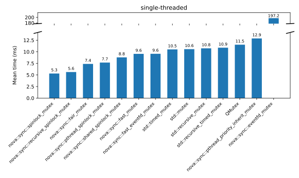
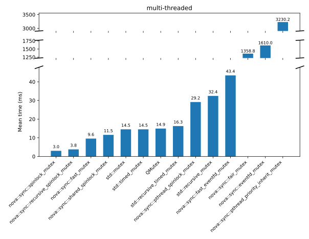
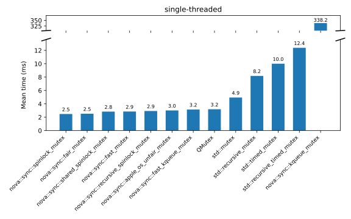
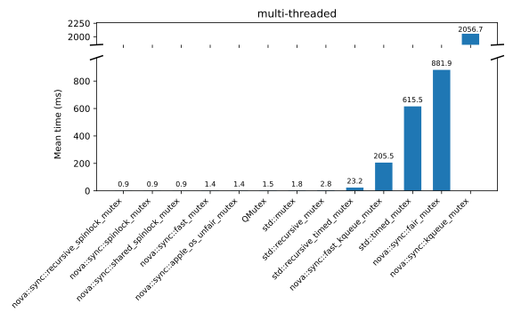
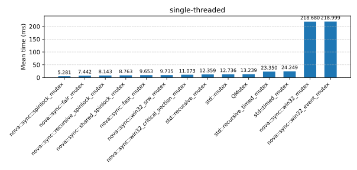
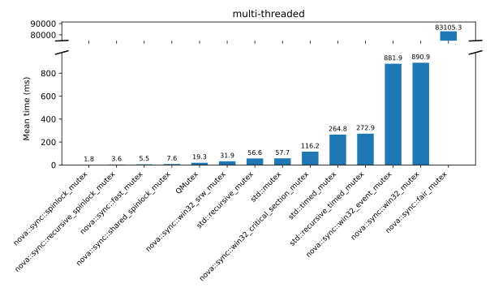

# nova::sync

Synchronization primitives for C++20: specialized mutex and event types optimized for different use cases.

## Mutex Types

| Type | Characteristics | Named Requirement |
|------|-----------------|-------------------|
| `spinlock_mutex` | Simple spinlock | `Mutex` |
| `recursive_spinlock_mutex` | Recursive spinlock  | `Mutex` |
| `pthread_spinlock_mutex` | `pthread_spinlock_t` based spinlock  | `Mutex` |
| `shared_spinlock_mutex` | Shared spinlock | `SharedMutex` |
| `fast_mutex` | Fast general purpose mutex | `Mutex` |
| `fair_mutex` | Ticket lock, FIFO fairness guaranteed | `Mutex` |
| `pthread_priority_ceiling_mutex` | POSIX real-time mutex (PTHREAD_PRIO_PROTECT), Linux/POSIX only | `TimedMutex` |
| `pthread_priority_inherit_mutex` | POSIX real-time mutex (PTHREAD_PRIO_INHERIT), Linux/POSIX only | `TimedMutex` |
| `win32_recursive_mutex` | Win32 CRITICAL_SECTION, Windows only | `Mutex` |
| `win32_mutex` | Win32 kernel mutex, async-capable, Windows only | `TimedMutex` |
| `win32_srw_mutex` | Win32 SRW lock (ultra-lightweight), Windows only | `Mutex` |
| `apple_os_unfair_mutex` | Apple `os_unfair_lock`, macOS/iOS only | `Mutex` |
| `kqueue_mutex` | Apple kqueue-based async mutex, macOS/iOS only | `Mutex` |
| `eventfd_mutex` | Linux eventfd-based async mutex | `Mutex` |
| `native_async_mutex` | Cross-platform alias: `win32_mutex` / `kqueue_mutex` / `eventfd_mutex` | `Mutex` |

### `fast_mutex`

Lock-free fast path using `std::atomic::wait()`. Superior performance to `std::mutex` under low-to-moderate contention.

### `fair_mutex`

Ticket lock guaranteeing FIFO lock acquisition order. Prevents starvation under high contention.

### POSIX real-time mutexes

Priority ceiling and inheritance protocols prevent priority inversion. Significantly higher locking overhead; suitable only for real-time systems requiring deterministic scheduling.

### Platform-specific async mutexes

`win32_mutex`, `kqueue_mutex`, and `eventfd_mutex` (cross-platform alias: `native_async_mutex`)
expose native OS handles enabling integration with event loops (Boost.Asio, libdispatch, epoll, Qt, etc.).

Handlers receive an `expected<std::unique_lock<Mutex>, std::error_code>` (`std::expected` or `tl::expected`):

```cpp
void handler(expected<std::unique_lock<Mutex>, std::error_code> result);
```

**Boost.Asio — callback:**

```cpp
#include <nova/sync/mutex/boost_asio_support.hpp>

nova::sync::native_async_mutex mtx;
boost::asio::io_context        ioc;

// Non-cancellable:
nova::sync::async_acquire(ioc, mtx,
    [](auto result) {
        if (!result) return; // unexpected error
        auto& lock = *result; // lock.owns_lock() == true — critical section here
        // lock releases the mutex automatically on scope exit
    });

// Cancellable:
auto handle = nova::sync::async_acquire_cancellable(ioc, mtx,
    [](auto result) {
        if (!result) {
            if (result.error() == std::errc::operation_canceled) return; // cancelled
            return; // other error
        }
        auto& lock = *result; // lock.owns_lock() == true
    });
handle.cancel(); // abort the pending wait from any thread
```

**Boost.Asio — future:**

```cpp
#include <nova/sync/mutex/boost_asio_support.hpp>

nova::sync::native_async_mutex mtx;
boost::asio::io_context        ioc;

auto [descriptor, fut] = nova::sync::async_acquire(ioc, mtx);
// descriptor keeps the wait alive; fut becomes ready when the lock is acquired

std::unique_lock lock = fut.get(); // blocks until acquired; lock.owns_lock() == true

// To cancel: descriptor->cancel(); // fut will never become ready
```

### Thread Safety Analysis

All mutex types are annotated for Clang's thread-safety analysis (`-Wthread-safety`). Macros in `<nova/sync/mutex/tsa_macros.hpp>` map to TSA attributes (e.g., `NOVA_SYNC_GUARDED_BY`, `NOVA_SYNC_REQUIRES`, `NOVA_SYNC_EXCLUDES`, `NOVA_SYNC_ACQUIRE`, `NOVA_SYNC_RELEASE`) on Clang and expand to nothing on other compilers.

**Typical usage:**
```cpp
nova::sync::spinlock_mutex mtx;
int counter NOVA_SYNC_GUARDED_BY(mtx);

void increment() NOVA_SYNC_REQUIRES(mtx) { counter++; }

{
    nova::sync::lock_guard lock(mtx);
    increment();  // OK: mtx held by lock_guard
}
increment();      // Error: mutex not held
```


### Benchmarks

The following results were recorded on Ubuntu 25.04 on an Intel i7-14700K.

#### Linux (Ubuntu 25.10) — Intel i7-14700K

Single-threaded benchmark:



Multi-threaded benchmark:



#### macOS - Apple M4 Pro

Single-threaded benchmark:



Multi-threaded benchmark:



#### Windows 11 — Intel i7-14700K

Single-threaded benchmark:



Multi-threaded benchmark:




## Semaphore Types

| Type | Timed waits | Native handle | Platform |
|------|-------------|---------------|----------|
| `fast_semaphore` | — | — | Cross-platform |
| `timed_counting_semaphore` | `try_acquire_for` / `try_acquire_until` | — | Cross-platform |
| `posix_semaphore` | `try_acquire_for` / `try_acquire_until` | — | Linux |
| `win32_semaphore` | `try_acquire_for` / `try_acquire_until` | `native_handle()` | Windows |
| `eventfd_semaphore` | `try_acquire_for` / `try_acquire_until` | `native_handle()` | Linux |
| `kqueue_semaphore` | `try_acquire_for` / `try_acquire_until` | `native_handle()` | macOS/iOS |
| `mach_semaphore` | `try_acquire_for` / `try_acquire_until` | — | macOS/iOS |
| `dispatch_semaphore` | `try_acquire_for` / `try_acquire_until` | — | macOS/iOS |
| `native_async_semaphore` | `try_acquire_for` / `try_acquire_until` | `native_handle()` | Platform-specific alias |

### Platform-specific async semaphores

`win32_semaphore`, `eventfd_semaphore`, `kqueue_semaphore`, and `mach_semaphore` wrap OS primitives and expose `native_handle()` for integration with event loops (Boost.Asio, libdispatch, epoll, Qt, etc.).

```cpp
nova::sync::counting_semaphore sem(0);

// Producer thread
sem.release(5);  // add 5 tokens

// Consumer thread
sem.acquire();   // block until token available; consumes one
if (sem.try_acquire())  // non-blocking; consumes if available
    // ... token acquired
```

Async integration (with `native_async_semaphore`):

```cpp
nova::sync::native_async_semaphore sem(0);

// Register for async notification when a token becomes available
auto handle = nova::sync::async_acquire_cancellable(ioc, sem,
    [](auto result) {
        if (result) {
            // Token acquired; use it
        } else if (result.error() == std::errc::operation_canceled) {
            // Wait was cancelled
        }
    });

handle.cancel();  // abort pending wait
```

## Event Types

| Type | Timed waits | Reset | Native handle |
|------|-------------|-------|---------------|
| `manual_reset_event` | — | Manual | — |
| `timed_manual_reset_event` | `try_wait_for` / `try_wait_until` | Manual | — |
| `native_manual_reset_event`| `try_wait_for` / `try_wait_until` | Manual | `native_handle()` |
| `auto_reset_event` | — | Automatic | — |
| `timed_auto_reset_event` | `try_wait_for` / `try_wait_until` | Automatic | — |
| `native_auto_reset_event`  | `try_wait_for` / `try_wait_until` | Automatic | `native_handle()` |

### Manual-reset events

Once `signal()` is called, all waiters are woken and subsequent `wait()` / `try_wait()` calls return immediately until `reset()` is called.

### Auto-reset events

Each `signal()` delivers exactly one token. A blocked waiter consumes it; otherwise the next `wait()` / `try_wait()` call consumes it.

### Native events

The `native_*` variants map to OS primitives (`eventfd` on Linux, `kqueue` on macOS, `SetEvent` on Windows) and expose `native_handle()` for integration with event loops, C++20 coroutines, or C++26 executors.

```cpp
nova::sync::manual_reset_event ev;

// Producer thread
ev.signal();          // wake all waiters; event stays set

// Consumer threads
ev.wait();            // block until set
ev.try_wait();        // non-blocking check
ev.reset();           // clear the event
```

```cpp
nova::sync::auto_reset_event ev;

// Producer thread
ev.signal();          // deliver one token

// Consumer thread
ev.wait();            // block until a token is available; consumes it
ev.try_wait();        // non-blocking; returns true and consumes token if available
```

## Dependencies

- C++20 (GCC 12+, Clang 17+, MSVC 2022+)
- No external dependencies for core library
- Tests require Catch2 and Boost.asio (fetched via CPM)

## Building

```sh
cmake -B build
cmake --build build
ctest --test-dir build
```

## License

MIT — see [License.txt](License.txt)
