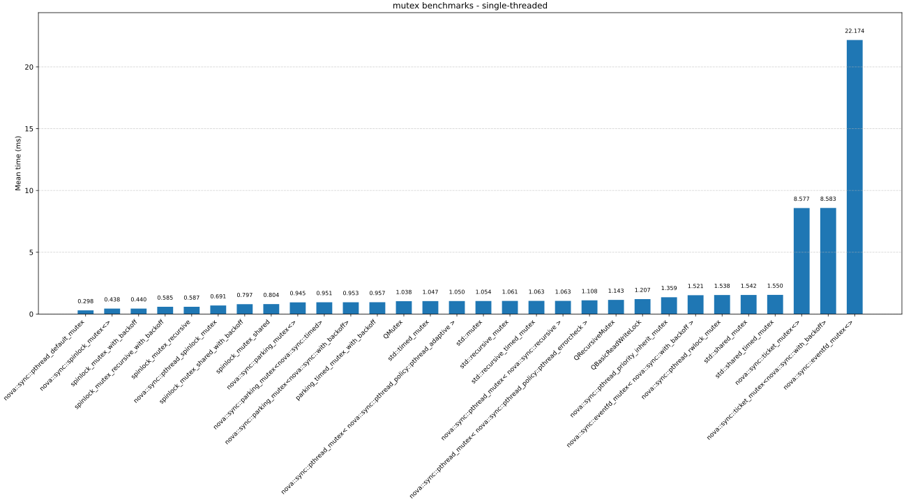
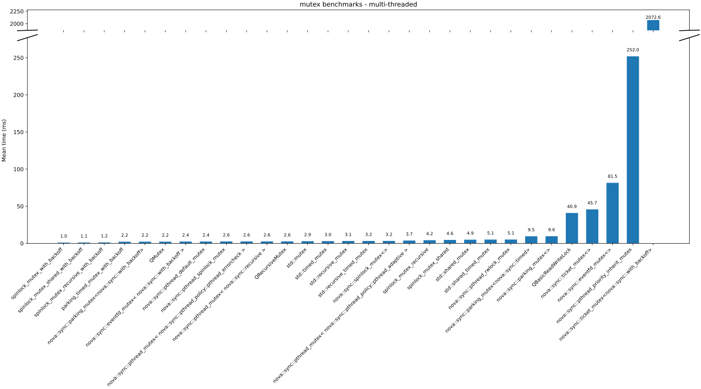
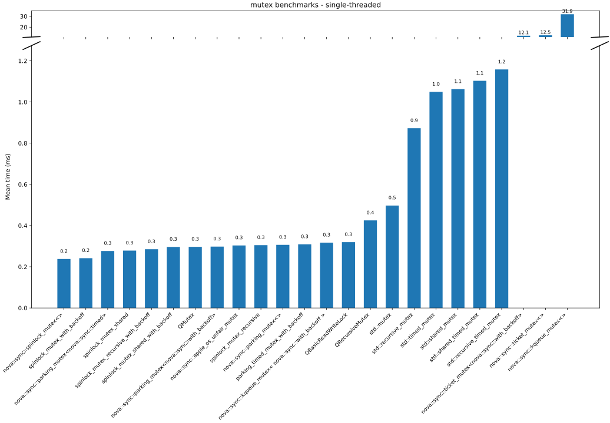
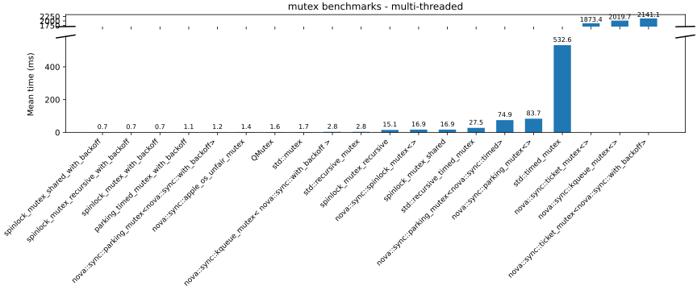
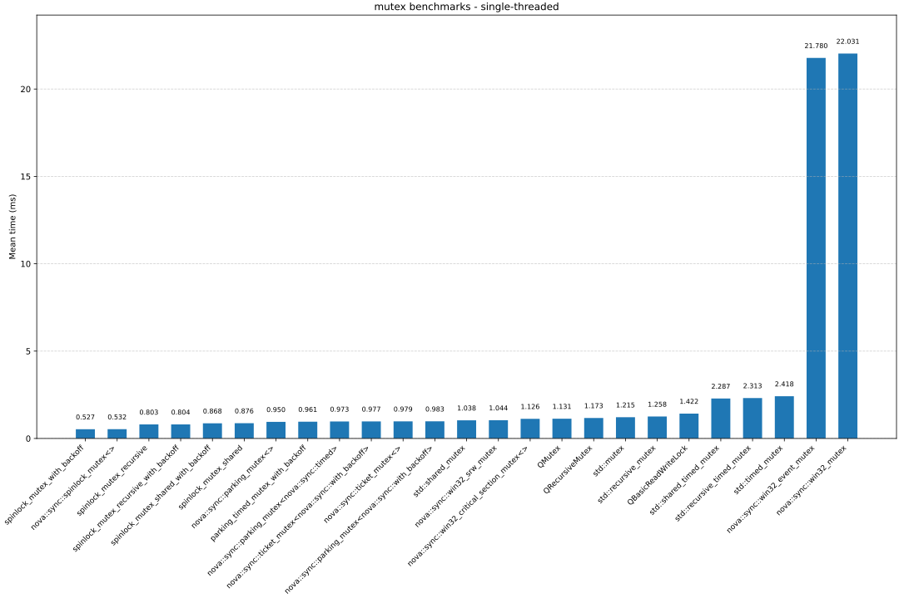
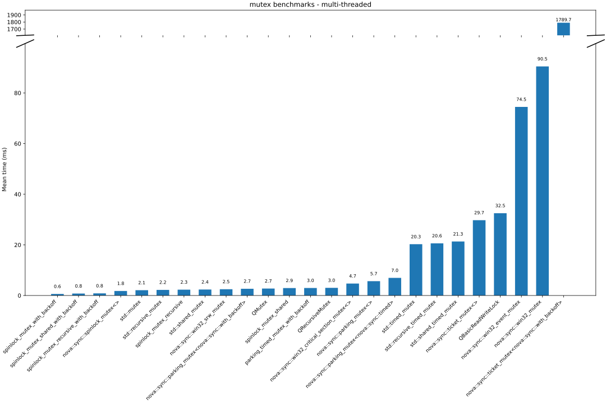

# nova::sync

Synchronization primitives for C++20: specialized mutex, semaphore and event types optimized for different use cases.
Most notably this includes variants which can be integrated into native event loops (Boost.Asio, libdispatch, epoll, Qt, etc.), allowing to wait asynchronously for a lock or event without blocking the thread.

## Mutex Types

### `parking_mutex`
Futex-based mutex with configurable backoff.
- **Policies**:
  - `with_backoff`: Spins briefly with exponential backoff before parking, resulting in lower latency under brief contention.
  - `timed`: Enables timed waits via `try_lock_for` / `try_lock_until`.

### `ticket_mutex`
Fair FIFO ticket lock guaranteeing strict acquisition order. Prevents starvation under sustained contention, but is not suitable for high-throughput low-contention workloads.
- **Policies**:
  - `with_backoff`: Spins with exponential backoff before parking.

### `spinlock_mutex`
Spinlock with different customization options.
- **Policies**:
  - `with_backoff`: Enables exponential backoff.
  - `recursive`: Allows re-entrant locking from the owning thread.
  - `shared`: Enables shared (reader-writer) locking via `lock_shared()` (mutually exclusive with `recursive`).

### POSIX Mutexes
POSIX wrappers available when targeting POSIX systems.
- **`pthread_mutex`**: Wraps `pthread_mutex_t`.
  - **Policies**:
    - `pthread_recursive`: Enables re-entrant locking (`PTHREAD_MUTEX_RECURSIVE`).
    - `pthread_errorcheck`: Emits an error on double-lock (`PTHREAD_MUTEX_ERRORCHECK`).
    - `pthread_adaptive`: Enables adaptive-spin POSIX mutexes (Linux only, `PTHREAD_MUTEX_ADAPTIVE_NP`).
    - `priority_inherit`: Priority inheritance protocol where the owner is boosted to the highest waiter priority (`PTHREAD_PRIO_INHERIT`).
    - `priority_ceiling<N>`: Priority ceiling protocol where all holders are elevated to ceiling N (`PTHREAD_PRIO_PROTECT`).
- **`pthread_spinlock_mutex`**: Wraps `pthread_spinlock_t`.
- **`pthread_rwlock_mutex`**: Wraps `pthread_rwlock_t` for a POSIX reader-writer lock.

Note, `priority_inherit` and `priority_ceiling` policies typically require `CAP_SYS_NICE` or equivalent.

### Windows Mutexes
Mutexes provided by the Win32 runtime.
- **`win32_critical_section_mutex`**: Wraps a Windows `CRITICAL_SECTION` (which is recursive by default).
  - **Policies**: `win32_spin_count<N>` sets a custom spin count before falling back to a kernel wait.
- **`win32_srw_mutex`**: Wraps the Slim Reader/Writer (SRW) lock for an ultra-lightweight Windows mutex.

### macOS / iOS Mutexes
Mutexes provided by Apple's runtime.
- **`apple_os_unfair_mutex`**: Wraps `os_unfair_lock`.

### Platform-specific Async Mutexes
`win32_event_mutex` (Windows), `kqueue_mutex` (macOS/iOS), and `eventfd_mutex` (Linux).
These expose native OS handles (`native_handle()`) enabling integration with event loops (Boost.Asio, libdispatch, epoll, Qt, etc.).
- **Policies**:
  - `with_backoff`: Spins with exponential backoff before falling back to OS waits.
- **Aliases**:
  - `native_async_mutex`: Resolves to the pure async mutex for the current platform (e.g. `kqueue_mutex<>`).
  - `native_fast_async_mutex`: Resolves to the async mutex with backoff for the current platform (e.g. `kqueue_mutex<with_backoff>`).

Handlers receive an `expected<std::unique_lock<Mutex>, std::error_code>` (`std::expected` or `tl::expected`):

```cpp
void handler(expected<std::unique_lock<Mutex>, std::error_code> result);
```

**Boost.Asio — callback:**

```cpp
#include <nova/sync/mutex/boost_asio_support.hpp>

nova::sync::native_async_mutex mtx;
boost::asio::io_context        ioc;

// Non-cancellable:
nova::sync::async_acquire(ioc, mtx,
    [](auto result) {
        if (!result) return; // unexpected error
        auto& lock = *result; // lock.owns_lock() == true — critical section here
        // lock releases the mutex automatically on scope exit
    });

// Cancellable:
auto handle = nova::sync::async_acquire_cancellable(ioc, mtx,
    [](auto result) {
        if (!result) {
            if (result.error() == std::errc::operation_canceled) return; // cancelled
            return; // other error
        }
        auto& lock = *result; // lock.owns_lock() == true
    });
handle.cancel(); // abort the pending wait from any thread
```

**Boost.Asio — future:**

```cpp
#include <nova/sync/mutex/boost_asio_support.hpp>

nova::sync::native_async_mutex mtx;
boost::asio::io_context        ioc;

auto [descriptor, fut] = nova::sync::async_acquire(ioc, mtx);
// descriptor keeps the wait alive; fut becomes ready when the lock is acquired

std::unique_lock lock = fut.get(); // blocks until acquired; lock.owns_lock() == true

// To cancel: descriptor->cancel(); // fut will never become ready
```

### Thread Safety Analysis

All mutex types are annotated for Clang's thread-safety analysis (`-Wthread-safety`). Macros in `<nova/sync/thread_safety/macros.hpp>` map to TSA attributes (e.g., `NOVA_SYNC_GUARDED_BY`, `NOVA_SYNC_REQUIRES`, `NOVA_SYNC_EXCLUDES`, `NOVA_SYNC_ACQUIRE`, `NOVA_SYNC_RELEASE`) on Clang and expand to nothing on other compilers.

**Typical usage:**
```cpp
nova::sync::spinlock_mutex mtx;
int counter NOVA_SYNC_GUARDED_BY(mtx);

void increment() NOVA_SYNC_REQUIRES(mtx) { counter++; }

{
    nova::sync::lock_guard lock(mtx);
    increment();  // OK: mtx held by lock_guard
}
increment();      // Error: mutex not held
```


### `locked_object<T, Mutex>` — Rust-inspired Thread-Safe Value Wrapper

Type-safe RAII wrapper pairing a value `T` with a `Mutex`, enforcing synchronized via a smart-pointer style interface. The value is only accessible through lock guards. Supports exclusive locking (mutual exclusion) and shared locking (read-write patterns with `std::shared_mutex` or compatible).

```cpp
#include <nova/sync/thread_safety/locked_object.hpp>

nova::sync::locked_object< int > counter( 0 );

// Exclusive lock on non-const instance → mutable access
{
    auto guard = counter.lock();  // returns locked_object_guard<int, std::mutex>
    *guard = 42;
}

// Const instance can acquire exclusive lock → const access
const auto& const_counter = counter;
{
    auto guard = const_counter.lock();  // returns locked_object_guard<const int, std::mutex>
    // *guard = 42;  // compile error: const access
    int val = *guard;  // OK
}

// Try-lock (non-blocking)
if (auto guard = counter.try_lock()) {
    *guard += 1;
}

// Shared lock (requires std::shared_mutex)
nova::sync::locked_object< std::vector<int>, std::shared_mutex > data( {} );
{
    auto guard = data.lock_shared();  // returns shared_locked_object_guard<...>
    for (int x : *guard) { /* ... */ }  // concurrent readers allowed
}

// Higher-order: lock_and (acquire lock, invoke function, auto-release)
counter.lock_and( [](int& v) {
    v = 100;
} );

int squared = counter.lock_and( [](const int& v) {
    return v * v;
} );

// Try-lock_and (non-blocking higher-order)
auto updated = counter.try_lock_and( [](int& v) {
    v += 10;
    return v;
} );  // returns std::optional<int>

// Shared lock higher-order
int sum = data.lock_shared_and( [](const std::vector<int>& v) {
    int result = 0;
    for (int x : v) result += x;
    return result;
} );
```

### Benchmarks

The following results were recorded on Ubuntu 25.04 on an Intel i7-14700K.

#### Linux (Ubuntu 25.10) — Intel i7-14700K

Single-threaded benchmark:



Multi-threaded benchmark:



#### macOS - Apple M4 Pro

Single-threaded benchmark:



Multi-threaded benchmark:



#### Windows 11 — Intel i7-14700K

Single-threaded benchmark:



Multi-threaded benchmark:




## Semaphore Types

### `parking_semaphore`
Cross-platform lock-free counting semaphore based on futex.
- **Policies**:
  - `with_backoff`: Spins with exponential backoff before parking.

### `timed_semaphore`
- **`timed_semaphore`**: Timed futex-based semaphore.
  - **Policies**: `with_backoff` enables exponential backoff.

### Platform-specific Async Semaphores
These variants wrap OS primitives and expose `native_handle()` for integration with event loops (Boost.Asio, libdispatch, epoll, Qt, etc.).
- **Windows**: `win32_semaphore`.
- **Linux**: `eventfd_semaphore`.
- **macOS / iOS**: `kqueue_semaphore`.
- **Aliases**: `native_async_semaphore` resolves to the async semaphore with a native handle for the platform.

```cpp
nova::sync::parking_semaphore sem(0);

// Producer thread
sem.release(5);  // add 5 tokens

// Consumer thread
sem.acquire();   // block until token available; consumes one
if (sem.try_acquire())  // non-blocking; consumes if available
    // ... token acquired
```

Async integration (with `native_async_semaphore`):

```cpp
nova::sync::native_async_semaphore sem(0);

// Register for async notification when a token becomes available
auto handle = nova::sync::async_acquire_cancellable(ioc, sem,
    [](auto result) {
        if (result) {
            // Token acquired; use it
        } else if (result.error() == std::errc::operation_canceled) {
            // Wait was cancelled
        }
    });

handle.cancel();  // abort pending wait
```

### Other Platform-specific Semaphores
- **Linux**: `posix_semaphore` (wrapper around `sem_t`).
- **macOS / iOS**: `mach_semaphore` (wrapper around `semaphore_t`) and `dispatch_semaphore` (wrapper around `dispatch_semaphore_t`).


## Event Types (Auto-reset / Manual-reset)

### Manual-reset Events
Once `signal()` is called, all waiters are woken and subsequent `wait()` / `try_wait()` calls return immediately until `reset()` is called.
- **`parking_manual_reset_event`**: Futex-based manual reset event.
  - **Policies**: `with_backoff` enables exponential backoff.
- **`native_manual_reset_event`**: Maps to OS primitives (`eventfd` on Linux, `kqueue` on macOS, `SetEvent` on Windows) and exposes `native_handle()` for integration with event loops.

### Auto-reset Events
Each `signal()` delivers exactly one token. A blocked waiter consumes it; otherwise the next `wait()` / `try_wait()` call consumes it.
- **`parking_auto_reset_event`**: Futex-based auto reset event.
  - **Policies**: `with_backoff` enables exponential backoff.
- **`timed_auto_reset_event`**: Supports timed waits.
- **`native_auto_reset_event`**: Maps to OS primitives (`eventfd` on Linux, `kqueue` on macOS, `SetEvent` on Windows) and exposes `native_handle()` for integration with event loops.

```cpp
nova::sync::parking_manual_reset_event ev;

// Producer thread
ev.signal();          // wake all waiters; event stays set

// Consumer threads
ev.wait();            // block until set
ev.try_wait();        // non-blocking check
ev.reset();           // clear the event
```

```cpp
nova::sync::parking_auto_reset_event ev;

// Producer thread
ev.signal();          // deliver one token

// Consumer thread
ev.wait();            // block until a token is available; consumes it
ev.try_wait();        // non-blocking; returns true and consumes token if available
```

## Dependencies

- C++20 (GCC 12+, Clang 17+, MSVC 2022+)
- No external dependencies for core library
- Tests require Catch2 and Boost.asio (fetched via CPM)

## Building

```sh
cmake -B build
cmake --build build
ctest --test-dir build
```

## License

MIT — see [License.txt](License.txt)
